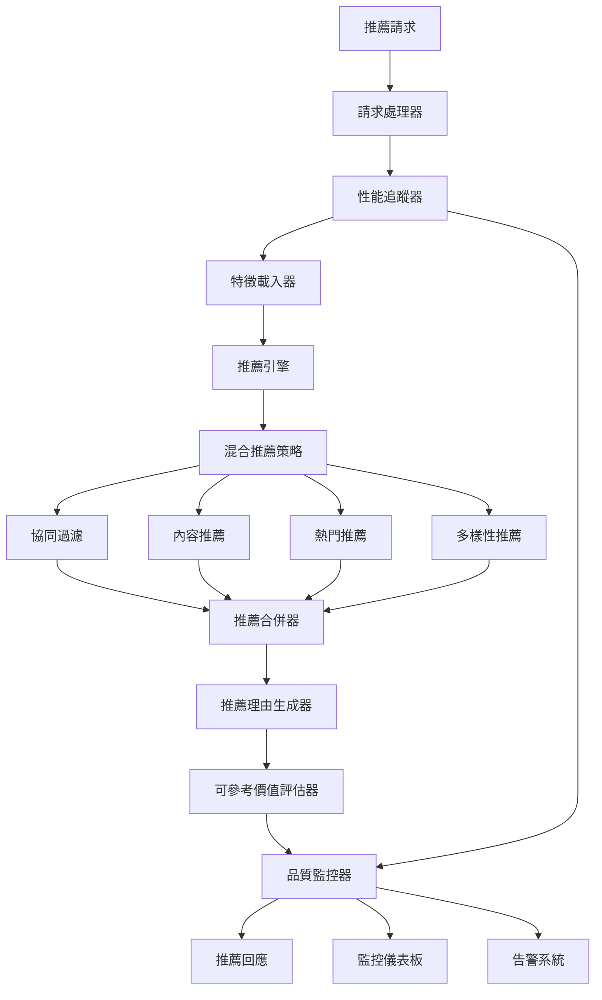
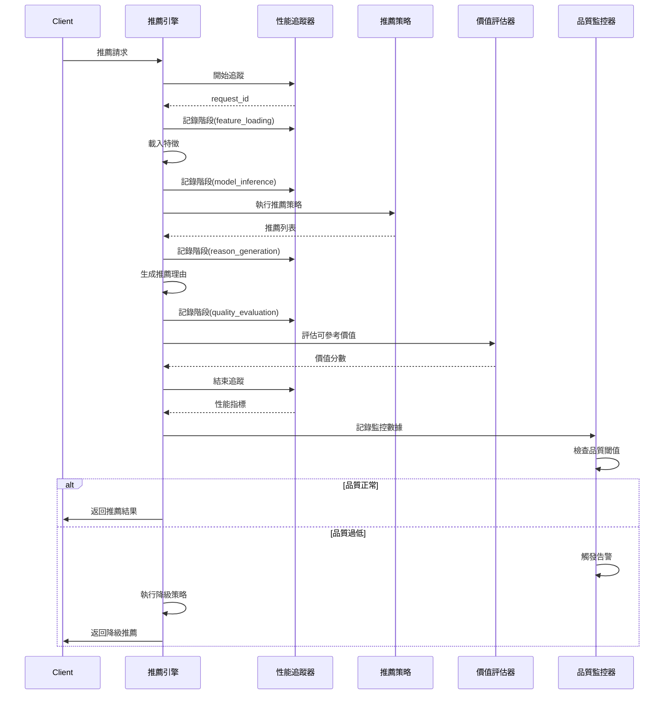
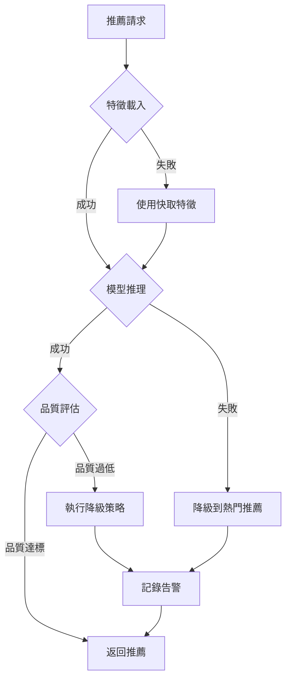

# 推薦系統改進設計文件

## 概述

本設計文件描述如何改進現有推薦系統，重點關注**推薦可參考價值**和**反應時間追蹤**。系統將建立一套完整的推薦品質評估體系，確保推薦結果對用戶具有實際參考價值，同時提供詳細的性能監控。

### 設計目標

1. **推薦可參考價值最大化**: 建立相關性、新穎性、可解釋性、多樣性四維評估體系
2. **反應時間可視化**: 追蹤每個環節的耗時，識別性能瓶頸
3. **品質監控自動化**: 即時監控推薦品質，異常時自動告警和降級
4. **業務價值導向**: 以用戶決策幫助程度為核心指標，而非僅關注技術指標

### 核心設計原則

- **品質優先**: 推薦可參考價值分數 > 反應時間 > 技術指標
- **可解釋性**: 每個推薦都必須有清晰的理由
- **可監控性**: 所有關鍵指標都可追蹤和分析
- **可降級性**: 品質下降時自動切換到備用策略

## 架構設計

### 系統架構圖



### 核心組件

1. **性能追蹤器 (PerformanceTracker)**: 追蹤每個環節的反應時間
2. **推薦引擎 (EnhancedRecommendationEngine)**: 整合多種推薦策略
3. **可參考價值評估器 (ReferenceValueEvaluator)**: 計算推薦品質分數
4. **品質監控器 (QualityMonitor)**: 監控推薦品質和性能
5. **推薦理由生成器 (ReasonGenerator)**: 生成個性化推薦理由


## 組件設計

### 1. 性能追蹤器 (PerformanceTracker)

#### 職責
- 追蹤推薦流程中每個環節的耗時
- 計算百分位數統計（P50、P95、P99）
- 識別慢查詢並記錄警告

#### 介面設計

```python
class PerformanceTracker:
    """性能追蹤器"""
    
    def start_tracking(self, request_id: str) -> None:
        """開始追蹤一個推薦請求"""
        
    def track_stage(self, request_id: str, stage: str) -> None:
        """記錄一個階段的完成時間"""
        
    def end_tracking(self, request_id: str) -> PerformanceMetrics:
        """結束追蹤並返回性能指標"""
        
    def get_statistics(self, time_window: timedelta) -> PerformanceStats:
        """獲取指定時間窗口的統計數據"""
```

#### 追蹤階段
1. **request_received**: 請求接收
2. **feature_loading**: 特徵載入
3. **model_inference**: 模型推理
4. **recommendation_merging**: 推薦合併
5. **reason_generation**: 理由生成
6. **quality_evaluation**: 品質評估
7. **response_sent**: 回應發送

#### 資料結構

```python
@dataclass
class PerformanceMetrics:
    request_id: str
    total_time_ms: float
    stage_times: Dict[str, float]  # 各階段耗時
    is_slow_query: bool  # 是否為慢查詢
    timestamp: datetime
```


### 2. 可參考價值評估器 (ReferenceValueEvaluator)

#### 職責
- 計算推薦的相關性、新穎性、可解釋性、多樣性分數
- 計算綜合可參考價值分數
- 提供分數的詳細解釋

#### 介面設計

```python
class ReferenceValueEvaluator:
    """推薦可參考價值評估器"""
    
    def evaluate(
        self, 
        recommendations: List[Recommendation],
        member_info: MemberInfo,
        member_history: MemberHistory
    ) -> ReferenceValueScore:
        """評估推薦的可參考價值"""
        
    def calculate_relevance(
        self,
        recommendations: List[Recommendation],
        member_info: MemberInfo
    ) -> float:
        """計算相關性分數 (0-100)"""
        
    def calculate_novelty(
        self,
        recommendations: List[Recommendation],
        member_history: MemberHistory
    ) -> float:
        """計算新穎性分數 (0-100)"""
        
    def calculate_explainability(
        self,
        recommendations: List[Recommendation]
    ) -> float:
        """計算可解釋性分數 (0-100)"""
        
    def calculate_diversity(
        self,
        recommendations: List[Recommendation]
    ) -> float:
        """計算多樣性分數 (0-100)"""
```

#### 評分算法

##### 相關性分數 (權重 40%)
```python
相關性分數 = (
    購買歷史匹配度 * 0.33 +
    瀏覽偏好匹配度 * 0.33 +
    消費水平匹配度 * 0.34
) * 100

# 購買歷史匹配度
- 推薦產品類別與歷史購買類別的重疊度
- 推薦產品品牌與歷史購買品牌的重疊度

# 瀏覽偏好匹配度
- 推薦產品與會員偏好產品的相似度
- 基於產品特徵的餘弦相似度

# 消費水平匹配度
- 推薦產品價格與會員平均消費的匹配度
- 使用高斯分布計算匹配分數
```

##### 新穎性分數 (權重 25%)
```python
新穎性分數 = (
    新類別比例 * 0.5 +
    新品牌比例 * 0.3 +
    新產品比例 * 0.2
) * 100

# 新類別比例
新類別數量 / 推薦總數

# 新品牌比例
新品牌數量 / 推薦總數

# 新產品比例
完全未購買過的產品數量 / 推薦總數
```

##### 可解釋性分數 (權重 20%)
```python
可解釋性分數 = (
    理由完整性 * 0.4 +
    理由相關性 * 0.4 +
    理由多樣性 * 0.2
) * 100

# 理由完整性
- 每個推薦都有理由: 100分
- 部分推薦有理由: 按比例計分

# 理由相關性
- 理由與會員特徵的相關度
- 使用關鍵詞匹配和語義分析

# 理由多樣性
- 推薦理由的多樣化程度
- 避免所有推薦使用相同理由
```

##### 多樣性分數 (權重 15%)
```python
多樣性分數 = (
    類別多樣性 * 0.4 +
    價格多樣性 * 0.3 +
    品牌多樣性 * 0.3
) * 100

# 類別多樣性
不同類別數量 / min(推薦總數, 總類別數)

# 價格多樣性
使用標準差衡量價格分散度

# 品牌多樣性
不同品牌數量 / min(推薦總數, 總品牌數)
```

#### 資料結構

```python
@dataclass
class ReferenceValueScore:
    overall_score: float  # 綜合分數 (0-100)
    relevance_score: float  # 相關性分數
    novelty_score: float  # 新穎性分數
    explainability_score: float  # 可解釋性分數
    diversity_score: float  # 多樣性分數
    score_breakdown: Dict[str, Any]  # 詳細分數拆解
    timestamp: datetime
```


### 3. 增強推薦引擎 (EnhancedRecommendationEngine)

#### 職責
- 整合多種推薦策略
- 執行混合推薦算法
- 協調各組件的工作流程

#### 介面設計

```python
class EnhancedRecommendationEngine:
    """增強版推薦引擎"""
    
    def __init__(self):
        self.performance_tracker = PerformanceTracker()
        self.value_evaluator = ReferenceValueEvaluator()
        self.quality_monitor = QualityMonitor()
        self.reason_generator = ReasonGenerator()
        
    def recommend(
        self,
        member_info: MemberInfo,
        n: int = 5,
        strategy: str = 'hybrid'
    ) -> EnhancedRecommendationResponse:
        """生成增強版推薦"""
```

#### 推薦流程



#### 混合推薦策略

```python
# 策略權重配置
STRATEGY_WEIGHTS = {
    'collaborative_filtering': 0.40,  # 協同過濾
    'content_based': 0.30,           # 內容推薦
    'popularity': 0.20,              # 熱門推薦
    'diversity': 0.10                # 多樣性推薦
}

# 推薦生成流程
def generate_hybrid_recommendations(member_info, n):
    recommendations = []
    
    # 1. 協同過濾推薦
    cf_count = int(n * STRATEGY_WEIGHTS['collaborative_filtering'])
    cf_recs = collaborative_filtering_recommend(member_info, cf_count)
    recommendations.extend(cf_recs)
    
    # 2. 內容推薦
    content_count = int(n * STRATEGY_WEIGHTS['content_based'])
    content_recs = content_based_recommend(member_info, content_count)
    recommendations.extend(content_recs)
    
    # 3. 熱門推薦
    popular_count = int(n * STRATEGY_WEIGHTS['popularity'])
    popular_recs = popularity_recommend(member_info, popular_count)
    recommendations.extend(popular_recs)
    
    # 4. 多樣性推薦
    diversity_count = int(n * STRATEGY_WEIGHTS['diversity'])
    diversity_recs = diversity_recommend(member_info, diversity_count)
    recommendations.extend(diversity_recs)
    
    # 5. 去重和排序
    unique_recs = deduplicate(recommendations)
    sorted_recs = sort_by_confidence(unique_recs)
    
    return sorted_recs[:n]
```


### 4. 品質監控器 (QualityMonitor)

#### 職責
- 即時監控推薦品質和性能
- 檢測異常並觸發告警
- 生成監控報告和趨勢分析

#### 介面設計

```python
class QualityMonitor:
    """推薦品質監控器"""
    
    def record_recommendation(
        self,
        request_id: str,
        member_code: str,
        value_score: ReferenceValueScore,
        performance_metrics: PerformanceMetrics
    ) -> None:
        """記錄一次推薦的品質和性能數據"""
        
    def check_quality_threshold(
        self,
        value_score: ReferenceValueScore
    ) -> QualityCheckResult:
        """檢查品質是否達標"""
        
    def check_performance_threshold(
        self,
        performance_metrics: PerformanceMetrics
    ) -> PerformanceCheckResult:
        """檢查性能是否達標"""
        
    def generate_hourly_report(self) -> MonitoringReport:
        """生成小時報告"""
        
    def generate_daily_report(self) -> MonitoringReport:
        """生成日報"""
```

#### 監控指標

```python
# 品質閾值
QUALITY_THRESHOLDS = {
    'overall_score': {
        'critical': 40,  # 低於40分觸發嚴重告警
        'warning': 50,   # 低於50分觸發警告
        'target': 60     # 目標值
    },
    'relevance_score': {
        'critical': 50,
        'warning': 60,
        'target': 70
    },
    'novelty_score': {
        'critical': 15,
        'warning': 20,
        'target': 30
    },
    'explainability_score': {
        'critical': 60,
        'warning': 70,
        'target': 80
    },
    'diversity_score': {
        'critical': 40,
        'warning': 50,
        'target': 60
    }
}

# 性能閾值
PERFORMANCE_THRESHOLDS = {
    'total_time_ms': {
        'p50': 200,
        'p95': 500,
        'p99': 1000
    },
    'feature_loading_ms': {
        'max': 100
    },
    'model_inference_ms': {
        'max': 200
    }
}
```

#### 告警機制

```python
class AlertLevel(Enum):
    INFO = "info"
    WARNING = "warning"
    CRITICAL = "critical"

@dataclass
class Alert:
    level: AlertLevel
    metric_name: str
    current_value: float
    threshold_value: float
    message: str
    timestamp: datetime
    
# 告警觸發條件
def check_and_alert(value_score, performance_metrics):
    alerts = []
    
    # 檢查品質分數
    if value_score.overall_score < QUALITY_THRESHOLDS['overall_score']['critical']:
        alerts.append(Alert(
            level=AlertLevel.CRITICAL,
            metric_name='overall_score',
            current_value=value_score.overall_score,
            threshold_value=QUALITY_THRESHOLDS['overall_score']['critical'],
            message=f"推薦可參考價值分數過低: {value_score.overall_score:.1f}",
            timestamp=datetime.now()
        ))
    
    # 檢查反應時間
    if performance_metrics.total_time_ms > PERFORMANCE_THRESHOLDS['total_time_ms']['p99']:
        alerts.append(Alert(
            level=AlertLevel.WARNING,
            metric_name='response_time',
            current_value=performance_metrics.total_time_ms,
            threshold_value=PERFORMANCE_THRESHOLDS['total_time_ms']['p99'],
            message=f"推薦反應時間過長: {performance_metrics.total_time_ms:.1f}ms",
            timestamp=datetime.now()
        ))
    
    return alerts
```


### 5. 推薦理由生成器 (ReasonGenerator)

#### 職責
- 生成個性化推薦理由
- 確保理由的相關性和多樣性
- 提升推薦的可解釋性分數

#### 介面設計

```python
class ReasonGenerator:
    """推薦理由生成器"""
    
    def generate_reason(
        self,
        member_info: MemberInfo,
        product: Product,
        confidence_score: float,
        context: Dict[str, Any]
    ) -> str:
        """生成單個推薦的理由"""
        
    def generate_batch_reasons(
        self,
        recommendations: List[Recommendation],
        member_info: MemberInfo
    ) -> List[Recommendation]:
        """批量生成推薦理由"""
```

#### 理由模板庫

```python
REASON_TEMPLATES = {
    'consumption_level': {
        'high': ["符合您的高端消費偏好", "適合您的品質要求"],
        'medium': ["適合您的消費水平", "性價比優秀"],
        'low': ["經濟實惠的選擇", "超值推薦"]
    },
    'category_preference': {
        '保健': ["維護健康的好選擇", "關愛健康必備"],
        '美妝': ["美麗加分的選擇", "提升魅力必備"]
    },
    'brand_preference': {
        'preferred': ["您偏愛的品牌", "信賴品牌推薦"],
        'similar': ["與您喜愛品牌相似", "同等級品牌"]
    },
    'confidence_level': {
        'high': ["強烈推薦", "最適合您"],
        'medium': ["值得考慮", "推薦嘗試"],
        'low': ["可以嘗試", "備選方案"]
    }
}
```

## 資料模型

### 增強推薦回應

```python
@dataclass
class EnhancedRecommendationResponse:
    """增強版推薦回應"""
    member_code: str
    recommendations: List[Recommendation]
    
    # 可參考價值分數
    reference_value_score: ReferenceValueScore
    
    # 性能指標
    performance_metrics: PerformanceMetrics
    
    # 元資料
    total_count: int
    strategy_used: str
    model_version: str
    timestamp: datetime
    
    # 品質標記
    quality_level: str  # 'excellent', 'good', 'acceptable', 'poor'
    is_degraded: bool  # 是否使用降級策略
```

### 監控記錄

```python
@dataclass
class MonitoringRecord:
    """監控記錄"""
    request_id: str
    member_code: str
    timestamp: datetime
    
    # 品質指標
    overall_score: float
    relevance_score: float
    novelty_score: float
    explainability_score: float
    diversity_score: float
    
    # 性能指標
    total_time_ms: float
    feature_loading_ms: float
    model_inference_ms: float
    reason_generation_ms: float
    quality_evaluation_ms: float
    
    # 推薦元資料
    recommendation_count: int
    strategy_used: str
    is_degraded: bool
```


## 錯誤處理

### 降級策略

當推薦品質或性能不達標時，系統將自動執行降級策略：

```python
class DegradationStrategy:
    """降級策略"""
    
    def should_degrade(
        self,
        value_score: ReferenceValueScore,
        performance_metrics: PerformanceMetrics
    ) -> bool:
        """判斷是否需要降級"""
        # 品質過低
        if value_score.overall_score < 40:
            return True
        # 反應時間過長
        if performance_metrics.total_time_ms > 2000:
            return True
        return False
    
    def execute_degradation(
        self,
        member_info: MemberInfo,
        n: int
    ) -> List[Recommendation]:
        """執行降級推薦"""
        # 降級策略：使用簡單的熱門推薦
        return get_popular_recommendations(member_info, n)
```

### 異常處理流程



### 錯誤類型和處理

```python
class RecommendationError(Exception):
    """推薦系統錯誤基類"""
    pass

class FeatureLoadingError(RecommendationError):
    """特徵載入錯誤"""
    # 處理：使用快取特徵或預設特徵
    
class ModelInferenceError(RecommendationError):
    """模型推理錯誤"""
    # 處理：降級到規則推薦
    
class QualityThresholdError(RecommendationError):
    """品質閾值錯誤"""
    # 處理：執行降級策略並告警
    
class PerformanceThresholdError(RecommendationError):
    """性能閾值錯誤"""
    # 處理：優化查詢或使用快取
```

## 測試策略

### 單元測試

```python
# 測試可參考價值評估器
def test_reference_value_evaluator():
    evaluator = ReferenceValueEvaluator()
    
    # 測試相關性計算
    relevance = evaluator.calculate_relevance(recommendations, member_info)
    assert 0 <= relevance <= 100
    
    # 測試新穎性計算
    novelty = evaluator.calculate_novelty(recommendations, member_history)
    assert 0 <= novelty <= 100
    
    # 測試綜合分數
    score = evaluator.evaluate(recommendations, member_info, member_history)
    assert score.overall_score == (
        score.relevance_score * 0.4 +
        score.novelty_score * 0.25 +
        score.explainability_score * 0.2 +
        score.diversity_score * 0.15
    )

# 測試性能追蹤器
def test_performance_tracker():
    tracker = PerformanceTracker()
    request_id = "test_001"
    
    tracker.start_tracking(request_id)
    time.sleep(0.1)
    tracker.track_stage(request_id, "feature_loading")
    time.sleep(0.1)
    tracker.track_stage(request_id, "model_inference")
    
    metrics = tracker.end_tracking(request_id)
    assert metrics.total_time_ms >= 200
    assert "feature_loading" in metrics.stage_times
```

### 整合測試

```python
def test_enhanced_recommendation_flow():
    """測試完整推薦流程"""
    engine = EnhancedRecommendationEngine()
    member_info = create_test_member()
    
    # 執行推薦
    response = engine.recommend(member_info, n=5)
    
    # 驗證推薦結果
    assert len(response.recommendations) == 5
    assert response.reference_value_score.overall_score > 0
    assert response.performance_metrics.total_time_ms < 500
    
    # 驗證品質分數
    assert response.reference_value_score.relevance_score > 0
    assert response.reference_value_score.novelty_score > 0
    assert response.reference_value_score.explainability_score > 0
    assert response.reference_value_score.diversity_score > 0
```

### 性能測試

```python
def test_performance_under_load():
    """測試負載下的性能"""
    engine = EnhancedRecommendationEngine()
    
    # 模擬100個並發請求
    response_times = []
    for i in range(100):
        start = time.time()
        response = engine.recommend(create_test_member(), n=5)
        elapsed = (time.time() - start) * 1000
        response_times.append(elapsed)
    
    # 驗證性能指標
    p50 = np.percentile(response_times, 50)
    p95 = np.percentile(response_times, 95)
    p99 = np.percentile(response_times, 99)
    
    assert p50 < 200, f"P50 反應時間過長: {p50}ms"
    assert p95 < 500, f"P95 反應時間過長: {p95}ms"
    assert p99 < 1000, f"P99 反應時間過長: {p99}ms"
```


## 監控和可視化

### 監控儀表板

#### 即時監控面板

```
┌─────────────────────────────────────────────────────────────┐
│ 推薦系統即時監控                    更新時間: 2025-11-04 16:30 │
├─────────────────────────────────────────────────────────────┤
│ 推薦品質指標                                                  │
│ ┌─────────────────┬──────────┬──────────┬──────────┐        │
│ │ 指標            │ 當前值   │ 目標值   │ 狀態     │        │
│ ├─────────────────┼──────────┼──────────┼──────────┤        │
│ │ 綜合可參考價值  │ 65.2     │ > 60     │ ✓ 正常   │        │
│ │ 相關性分數      │ 72.5     │ > 70     │ ✓ 正常   │        │
│ │ 新穎性分數      │ 32.1     │ > 30     │ ✓ 正常   │        │
│ │ 可解釋性分數    │ 85.3     │ > 80     │ ✓ 正常   │        │
│ │ 多樣性分數      │ 58.7     │ > 60     │ ⚠ 警告   │        │
│ └─────────────────┴──────────┴──────────┴──────────┘        │
│                                                               │
│ 性能指標                                                      │
│ ┌─────────────────┬──────────┬──────────┬──────────┐        │
│ │ 指標            │ 當前值   │ 閾值     │ 狀態     │        │
│ ├─────────────────┼──────────┼──────────┼──────────┤        │
│ │ P50 反應時間    │ 185 ms   │ < 200 ms │ ✓ 正常   │        │
│ │ P95 反應時間    │ 420 ms   │ < 500 ms │ ✓ 正常   │        │
│ │ P99 反應時間    │ 850 ms   │ < 1000ms │ ✓ 正常   │        │
│ │ 特徵載入時間    │ 45 ms    │ < 100 ms │ ✓ 正常   │        │
│ │ 模型推理時間    │ 120 ms   │ < 200 ms │ ✓ 正常   │        │
│ └─────────────────┴──────────┴──────────┴──────────┘        │
│                                                               │
│ 最近告警 (最近1小時)                                          │
│ • 16:25 - [WARNING] 多樣性分數低於目標值: 58.7               │
│ • 16:18 - [INFO] 推薦請求量激增: 150 req/min                 │
└─────────────────────────────────────────────────────────────┘
```

#### 趨勢分析圖表

```python
# 可參考價值分數趨勢
def plot_value_score_trend(time_window='24h'):
    """繪製可參考價值分數趨勢圖"""
    # X軸: 時間
    # Y軸: 分數 (0-100)
    # 線條: 綜合分數、相關性、新穎性、可解釋性、多樣性
    
# 反應時間分布
def plot_response_time_distribution():
    """繪製反應時間分布圖"""
    # 直方圖顯示反應時間分布
    # 標記 P50、P95、P99 位置
    
# 各階段耗時佔比
def plot_stage_time_breakdown():
    """繪製各階段耗時佔比餅圖"""
    # 特徵載入、模型推理、理由生成、品質評估等
```

### 日報生成

```python
@dataclass
class DailyReport:
    """每日推薦品質報告"""
    date: date
    
    # 推薦量統計
    total_recommendations: int
    unique_members: int
    avg_recommendations_per_member: float
    
    # 品質統計
    avg_overall_score: float
    avg_relevance_score: float
    avg_novelty_score: float
    avg_explainability_score: float
    avg_diversity_score: float
    
    # 性能統計
    avg_response_time_ms: float
    p50_response_time_ms: float
    p95_response_time_ms: float
    p99_response_time_ms: float
    
    # 異常統計
    total_alerts: int
    critical_alerts: int
    warning_alerts: int
    degradation_count: int
    
    # 趨勢分析
    score_trend: str  # 'improving', 'stable', 'declining'
    performance_trend: str
    
    # 建議
    recommendations_for_improvement: List[str]
```

## 部署考量

### 配置管理

```python
# config/recommendation_config.yaml
recommendation:
  # 策略權重
  strategy_weights:
    collaborative_filtering: 0.40
    content_based: 0.30
    popularity: 0.20
    diversity: 0.10
  
  # 品質閾值
  quality_thresholds:
    overall_score:
      critical: 40
      warning: 50
      target: 60
    relevance_score:
      target: 70
    novelty_score:
      target: 30
    explainability_score:
      target: 80
    diversity_score:
      target: 60
  
  # 性能閾值
  performance_thresholds:
    total_time_ms:
      p50: 200
      p95: 500
      p99: 1000
    feature_loading_ms:
      max: 100
    model_inference_ms:
      max: 200
  
  # 監控配置
  monitoring:
    enable_real_time: true
    enable_hourly_report: true
    enable_daily_report: true
    alert_channels:
      - email
      - slack
    
  # 降級配置
  degradation:
    enable_auto_degradation: true
    degradation_threshold_score: 40
    degradation_threshold_time_ms: 2000
```

### 資料庫設計

```sql
-- 監控記錄表
CREATE TABLE monitoring_records (
    id BIGINT PRIMARY KEY AUTO_INCREMENT,
    request_id VARCHAR(50) NOT NULL,
    member_code VARCHAR(20) NOT NULL,
    timestamp DATETIME NOT NULL,
    
    -- 品質指標
    overall_score FLOAT,
    relevance_score FLOAT,
    novelty_score FLOAT,
    explainability_score FLOAT,
    diversity_score FLOAT,
    
    -- 性能指標
    total_time_ms FLOAT,
    feature_loading_ms FLOAT,
    model_inference_ms FLOAT,
    reason_generation_ms FLOAT,
    quality_evaluation_ms FLOAT,
    
    -- 元資料
    recommendation_count INT,
    strategy_used VARCHAR(50),
    is_degraded BOOLEAN,
    
    INDEX idx_timestamp (timestamp),
    INDEX idx_member_code (member_code),
    INDEX idx_overall_score (overall_score)
);

-- 告警記錄表
CREATE TABLE alert_records (
    id BIGINT PRIMARY KEY AUTO_INCREMENT,
    alert_level VARCHAR(20) NOT NULL,
    metric_name VARCHAR(50) NOT NULL,
    current_value FLOAT,
    threshold_value FLOAT,
    message TEXT,
    timestamp DATETIME NOT NULL,
    is_resolved BOOLEAN DEFAULT FALSE,
    
    INDEX idx_timestamp (timestamp),
    INDEX idx_alert_level (alert_level),
    INDEX idx_is_resolved (is_resolved)
);
```

## 實施計劃

### 階段 1: 核心組件開發 (第1-2週)
1. 實作 PerformanceTracker
2. 實作 ReferenceValueEvaluator
3. 實作 ReasonGenerator
4. 單元測試

### 階段 2: 推薦引擎整合 (第3週)
1. 實作 EnhancedRecommendationEngine
2. 整合各組件
3. 整合測試

### 階段 3: 監控系統開發 (第4週)
1. 實作 QualityMonitor
2. 建立監控儀表板
3. 實作告警機制

### 階段 4: 測試和優化 (第5週)
1. 性能測試
2. 負載測試
3. 優化瓶頸

### 階段 5: 部署和監控 (第6週)
1. 生產環境部署
2. A/B 測試
3. 持續監控和優化

## 成功指標

### 技術指標
- ✓ 推薦可參考價值分數平均 > 60分
- ✓ P95 反應時間 < 500ms
- ✓ 系統可用性 > 99.5%

### 業務指標
- ✓ 推薦點擊率提升 20%
- ✓ 推薦轉換率提升 15%
- ✓ 用戶滿意度 > 4.0/5.0

### 品質指標
- ✓ 相關性分數 > 70分
- ✓ 新穎性分數 > 30分
- ✓ 可解釋性分數 > 80分
- ✓ 多樣性分數 > 60分

